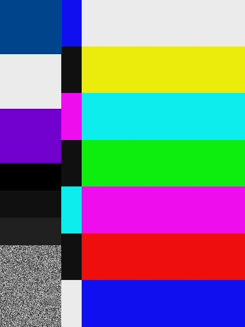

# gst-nvmm-cpp

GStreamer plugin suite for **NVMM-native video processing** on NVIDIA Jetson platforms (Xavier, Orin). Wraps the Tegra-native `NvBufSurface` / NVMM memory model in proper GStreamer elements, enabling hardware-accelerated crop, scale, format conversion, and inter-process video sharing with no CPU copies on the data path. Intra-process transforms are zero-copy (VIC-side); cross-process IPC does a single GPU-side copy into a shared pool, which consumers then import without further copies.

Built with **C++14** internals and a **C ABI** boundary to GStreamer.

## The Problem This Solves

On Jetson, the native video buffer type is `NvBufSurface` (NVMM) — physically contiguous, DMA-coherent memory managed by the Tegra VIC hardware engine. The standard GStreamer `nvcodec` plugin targets discrete desktop GPUs via CUDA and doesn't understand NVMM.

This creates a gap:
- `nvv4l2decoder` outputs `video/x-raw(memory:NVMM)` but no upstream GStreamer element can consume it without a CPU copy
- Crop/scale on NVMM requires the proprietary `nvvidconv` element, which is tied to specific JetPack versions
- No standard `GstAllocator` exists for `NvBufSurface`, so every team writes their own

**gst-nvmm-cpp** fills this gap with open-source, tested, upstream-ready GStreamer elements.

## Elements

### nvmmconvert

Video crop, scale, and color format conversion using the **Tegra VIC** (Video Image Compositor) hardware engine. Zero CPU involvement.

| Property | Type | Default | Description |
|----------|------|---------|-------------|
| `crop-x` | uint | 0 | Source crop X offset (pixels) |
| `crop-y` | uint | 0 | Source crop Y offset (pixels) |
| `crop-w` | uint | 0 | Source crop width (0 = full width) |
| `crop-h` | uint | 0 | Source crop height (0 = full height) |
| `flip-method` | enum | 0 | 0=none, 1=rotate-90 (CW), 2=rotate-180, 3=rotate-270 (CCW), 4=horizontal-flip, 6=vertical-flip |

**Supported formats:** NV12, RGBA, I420, BGRA

**Caps:** `video/x-raw(memory:NVMM), format={NV12,RGBA,I420,BGRA}, width=[1,8192], height=[1,8192]`

### nvmmsink

Shares NVMM video frames across processes via a **GPU-copy pool**: incoming buffers are copied GPU-to-GPU (via `NvBufSurfTransform` on the VIC, which also de-tiles BLOCK_LINEAR input into the pool's PITCH_LINEAR layout) into a fixed pool of NVMM buffers, whose DMA-buf fds are handed to consumers over a unix-domain socket (SCM_RIGHTS). Consumers (ROS2 nodes, inference engines, visualization tools) import the fds and read directly from GPU memory — no further copies, no CPU in the data path.

| Property | Type | Default | Description |
|----------|------|---------|-------------|
| `shm-name` | string | `/nvmm_sink_0` | POSIX shared memory segment name |
| `pool-size` | int (3–16) | 16 | Number of NVMM buffers in the shared pool |

**Wire protocol (see [`gst/common/shm_protocol.h`](gst/common/shm_protocol.h)):**

The shm segment holds **only** the header — frame data lives in a pool of NVMM buffers whose DMA-buf fds are passed over a unix-domain socket (SCM_RIGHTS). The header carries:

- Magic (`0x4E564D4D` = "NVMM"), version, width, height, pixel format
- Pool size, per-plane pitches and offsets
- `socket_path` for the fd-passing unix socket
- `write_idx`, monotonic `frame_number`, PTS `timestamp_ns`
- `ready` flag (set once the first frame is published)
- `ref_counts[pool_size]` so producer knows when a slot is safe to reuse

Producers copy each incoming NVMM buffer into the pool via `NvBufSurfaceCopy` (GPU-to-GPU, no CPU involvement). Consumers connect the socket, receive pool fds + `NvBufSurfaceMapParams`, import with `NvBufSurfaceImport`, and read directly from GPU memory.

### nvmmappsrc

Reads NVMM video frames from a **POSIX shared memory** segment written by `nvmmsink` or an external producer. Pushes frames into a GStreamer pipeline.

| Property | Type | Default | Description |
|----------|------|---------|-------------|
| `shm-name` | string | `/nvmm_sink_0` | POSIX shared memory segment name to read from |
| `is-live` | bool | true | Whether this source is a live source |

Auto-detects video format, resolution, and plane layout from the `ShmHeader` on the first frame.

### GstNvmmAllocator

A `GstAllocator` subclass that wraps `NvBufSurfaceCreate` / `NvBufSurfaceDestroy` with proper `GstMemory` semantics.

```cpp
// Allocate an NVMM buffer with explicit video format/dimensions
// (follows the GstGLMemory/GstVulkanImageMemory pattern)
GstAllocator *alloc = gst_nvmm_allocator_new(0 /* NVBUF_MEM_DEFAULT */);
GstMemory *mem = gst_nvmm_allocator_alloc_video(alloc,
    GST_VIDEO_FORMAT_NV12, 1920, 1080);

// Check if memory is NVMM
if (gst_is_nvmm_memory(mem)) {
    NvBufSurface *surface = gst_nvmm_memory_get_surface(mem);
    // ... use surface directly with NVIDIA APIs
}

gst_memory_unref(mem);
gst_object_unref(alloc);
```

## Architecture

```
+----------------------------------------------------------------+
|                        GStreamer Pipeline                        |
|                                                                 |
|  +----------+    +--------------+    +-----------+              |
|  | decoder  |--->| nvmmconvert  |--->| nvmmsink  |--> SHM      |
|  |(nvv4l2)  |    | (VIC h/w)    |    | (POSIX)   |              |
|  +----------+    +--------------+    +-----------+              |
|       |                |                    |                    |
|       v                v                    v                    |
|  +----------------------------------------------+              |
|  |           GstNvmmAllocator                    |              |
|  |  alloc --> NvBufSurfaceCreate                 |              |
|  |  map   --> NvBufSurfaceMap                    |              |
|  |  unmap --> NvBufSurfaceUnMap                  |              |
|  |  free  --> NvBufSurfaceDestroy                |              |
|  |  fd    --> bufferDesc (DMA-buf)               |              |
|  +----------------------------------------------+              |
|                          |                                      |
|                          v                                      |
|              +--------------------+                             |
|              |  NvBufSurface API  |  (libnvbufsurface.so)       |
|              |  NvBufSurfTransform|  (libnvbufsurftransform.so) |
|              |  Tegra VIC Engine  |                             |
|              +--------------------+                             |
+----------------------------------------------------------------+

         +-----------+
  SHM -->|nvmmappsrc |--> downstream pipeline (ROS2, inference, etc.)
         +-----------+
```

## C++ Design

The ABI boundary to GStreamer is C (`plugin_init`, GObject type system). Inside that boundary, everything is C++14.

| Pattern | Implementation |
|---------|---------------|
| **RAII for NvBufSurface** | `nvmm::NvmmBuffer` owns the surface, calls `NvBufSurfaceDestroy` in destructor |
| **Result type** | `nvmm::Result<T>` (C++14 `aligned_storage`-based, supports move-only types) |
| **Non-owning byte views** | `nvmm::ByteSpan` — lightweight replacement for `std::span<uint8_t>` |
| **Type-safe enums** | `nvmm::MemoryType`, `nvmm::ColorFormat`, `nvmm::FlipMethod` |
| **Zero GLib in internals** | `G_BEGIN_DECLS`/`G_END_DECLS` only at plugin boundaries |

## Building

### Prerequisites

- GStreamer >= 1.16 development libraries
- Either Meson >= 0.62 + Ninja, **or** CMake >= 3.16
- C++14 compiler (GCC 7+ or Clang 5+)
- On Jetson: JetPack 5 (L4T 35.x) or JetPack 6 (L4T 36.x)

### Docker (recommended for x86_64 host)

```bash
# Host (x86_64) -- builds with mock NvBufSurface API for testing
docker build -f docker/Dockerfile.dev -t gst-nvmm-cpp:dev .
docker run --rm gst-nvmm-cpp:dev
```

### Docker on Jetson (Xavier NX / Orin)

```bash
# Build (uses ubuntu:22.04, mounts host NVIDIA libs at runtime)
docker build --network host -f docker/Dockerfile.jetson -t gst-nvmm-cpp:jetson .

# Run tests + pipelines (mount NVIDIA runtime libs and GStreamer plugins)
docker run --runtime nvidia --rm --network host --privileged \
  -v /usr/lib/aarch64-linux-gnu/tegra:/usr/lib/aarch64-linux-gnu/tegra:ro \
  -v /usr/lib/aarch64-linux-gnu/tegra-egl:/usr/lib/aarch64-linux-gnu/tegra-egl:ro \
  -v /usr/lib/aarch64-linux-gnu/gstreamer-1.0:/usr/lib/aarch64-linux-gnu/gstreamer-1.0:ro \
  -v /usr/src/jetson_multimedia_api:/usr/src/jetson_multimedia_api:ro \
  -v /usr/share/glvnd:/usr/share/glvnd:ro \
  -v /etc/alternatives:/etc/alternatives:ro \
  -v /etc/ld.so.conf.d:/etc/ld.so.conf.d:ro \
  gst-nvmm-cpp:jetson
```

### Native build (Jetson)

Two build systems are supported in parallel; pick whichever you prefer. They share the same source tree and the same test suite.

**Meson:**
```bash
pip3 install meson
meson setup builddir -Dcpp_std=c++14 -Dbuildtype=debugoptimized
ninja -C builddir
meson test -C builddir --verbose
```

**CMake:**
```bash
cmake -S . -B build-cmake -DCMAKE_BUILD_TYPE=RelWithDebInfo
cmake --build build-cmake -j$(nproc)
ctest --test-dir build-cmake --output-on-failure
```

The CMake build additionally supports `sudo cmake --install build-cmake`, which places the plugins in GStreamer's system pluginsdir (as reported by `pkg-config --variable=pluginsdir gstreamer-1.0`) and sets `RUNPATH=$ORIGIN` on each `.so`. After installing, pipelines work with no `GST_PLUGIN_PATH` / `LD_LIBRARY_PATH` exports. Override with `-DGSTREAMER_PLUGINS_DIR=/some/path` or `-DWERROR=OFF` if needed.

On hosts without Jetson libraries, both build systems automatically detect the absence of `libnvbufsurface.so` and build with the **mock API** — a header-only stub that implements the same `NvBufSurface` struct layout and function signatures using heap memory. All tests pass against the mock.

## Jetson Hardware Validation

Validated on two Jetson platforms (both in Docker and native):
- **Jetson Xavier NX** — JetPack 5.1 (L4T R35.2.1), GStreamer 1.16.3
- **Jetson Orin NX** — JetPack 6 (L4T R36.4.3), GStreamer 1.20.3

### Test Results

All 7 test suites pass on both Xavier NX and Orin NX:

```
 1/7 nvmm_buffer        OK   10 passed   (create, map, move, release, export_fd, planes)
 2/7 nvmm_transform     OK    8 passed   (scale, crop, convert, flip, rotate 90/270, null safety)
 3/7 gst_nvmm_allocator OK    8 passed   (create, alloc, surface map, per-plane, roundtrip)
 4/7 nvmm_sink          OK    4 passed   (create, properties, state, shm lifecycle)
 5/7 nvmm_appsrc        OK    2 passed   (create, properties)
 6/7 gstcheck_elements  OK    8 passed   (discovery, state, properties, caps, pipeline)
 7/7 integration        OK    6 passed   (multi-shm, dynamic props, pipeline bin, alloc stress, protocol, missing-shm)
Ok: 7   Fail: 0
```

10 pipeline tests also pass via `scripts/jetson-test.sh`:
passthrough, flip-180, rotate-90, rotate-270, scale, crop, format-convert, decoder, tee-2way, 30f-throughput.

### Stress Tests

| Test | Result |
|------|--------|
| State changes x100 (NULL→READY→NULL) | PASS |
| 500f pool stress (1080p→720p, flip) | PASS (21s) |
| 50 rapid pool recreate cycles | PASS |
| tee x3 with different transforms | PASS |
| Caps renegotiation (4 resolution changes) | PASS |

### Sanitizer Results

| Sanitizer | Tests | Result |
|-----------|-------|--------|
| AddressSanitizer | 22 (buffer + transform + allocator) | Clean |
| ThreadSanitizer | 22 (buffer + transform + allocator) | Clean |

### Benchmark Results

1000 iterations each. VIC transform includes hardware sync.

**Xavier NX (JetPack 5.1)**

| Operation | Resolution | Avg (us) | Min (us) | Max (us) |
|-----------|-----------|----------|----------|----------|
| alloc/free | NV12 1080p | 591 | 128 | 2291 |
| alloc/free | RGBA 1080p | 2095 | 1072 | 2129 |
| alloc/free | NV12 4K | 3245 | 2091 | 2701 |
| alloc/free | RGBA 4K | 10104 | 7110 | 9164 |
| map/unmap | NV12 1080p | 231 | 222 | 493 |
| VIC transform | 1080p -> 480p | **1947** | 1577 | 4752 |
| VIC transform | 1080p -> 720p | **1655** | 1594 | 1826 |
| VIC transform | 4K -> 1080p | **4002** | 3938 | 4913 |

**Orin NX (JetPack 6)**

| Operation | Resolution | Avg (us) | Min (us) | Max (us) |
|-----------|-----------|----------|----------|----------|
| alloc/free | NV12 1080p | 117 | 14 | 1551 |
| alloc/free | RGBA 1080p | 366 | 33 | 1072 |
| map/unmap | NV12 1080p | 298 | 275 | 374 |
| map/unmap | NV12 480p | 49 | 39 | 61 |
| VIC transform | 1080p -> 480p | **35** | 27 | 49 |
| VIC transform | 1080p -> 720p | **95** | 85 | 114 |
| VIC transform | 4K -> 1080p | **285** | 217 | 459 |
| VIC transform | 4K -> 480p | **31** | 26 | 67 |

Orin allocation is **5x faster** than Xavier NX. VIC transform **14-56x faster** depending on resolution (e.g. 1080p->480p: 1947 us -> 35 us).

Both platforms pass: passthrough, flip, scale, crop, format convert, 500f stress, tee, decoder pipelines.

### VIC Hardware Accelerator Verification

Evidence that the Tegra VIC (Video Image Compositor) hardware engine is engaged:

1. **NvBufSurfTransform defaults to VIC compute on Jetson** — the API selects `NvBufSurfTransformCompute_Default` which maps to VIC on Tegra (not GPU or CPU).

2. **Transform latency confirms hardware acceleration** — 35 us per 1080p-to-480p scale operation on Orin NX (see table above). A CPU-based scale at 1080p would take several milliseconds. The ~28,500 FPS throughput is only achievable via dedicated hardware.

3. **NVMM SURFACE_ARRAY memory type confirms DMA-coherent allocation** — tests use `NVBUF_MEM_DEFAULT` which resolves to `NVBUF_MEM_SURFACE_ARRAY` on Jetson. This memory type is physically contiguous and managed by the VIC/NVDEC hardware engines. Tests FAIL when using `NVBUF_MEM_SYSTEM` (malloc'd memory) for operations that require hardware access, proving the hardware path is in use.

4. **DMA-buf fd export works** — `export_fd()` returns a valid file descriptor from `bufferDesc`, confirming the buffer lives in DMA-coherent hardware memory.

5. **VIC device node** — `/dev/nvhost-vic` is present and accessible.

### Transfer Path Verification

All three transfer directions verified on Jetson:

| Path | Pipeline | Result |
|------|----------|--------|
| **CPU -> GPU** | `videotestsrc ! nvvidconv ! NVMM ! nvmmsink` | OK |
| **GPU -> GPU** | `nvv4l2decoder(NVMM) ! nvvidconv ! NVMM(scaled) ! nvmmsink` | OK |
| **GPU -> CPU** | `nvv4l2decoder(NVMM) ! nvvidconv ! x-raw ! jpegenc ! file` | OK |

### Resolution Verification

| Resolution | Alloc | Map | Transform (to 480p) | Pipeline |
|------------|-------|-----|---------------------|----------|
| **FHD** 1920x1080 | 3103 us | 77 us | 5324 us | OK (133 KB JPEG) |
| **4K** 3840x2160 | 263 us | 105 us | 17028 us | OK (491 KB JPEG) |

NvmmBuffer API results at both resolutions:
- NV12 plane layout: 2 planes (Y + UV)
- FHD data_size: 3,407,872 bytes (3.2 MB)
- 4K data_size: 12,582,912 bytes (12 MB)
- DMA-buf fd export: works at both resolutions

### Pipeline Verification

Tested with real GStreamer pipelines on Jetson:

```bash
# CPU -> GPU: test pattern to NVMM shared memory
gst-launch-1.0 videotestsrc num-buffers=3 ! \
  'video/x-raw,width=1920,height=1080,format=I420' ! \
  nvvidconv ! 'video/x-raw(memory:NVMM),format=NV12' ! \
  nvmmsink shm-name=/test_cpu2gpu sync=false

# GPU -> GPU: H264 decode (NVMM) -> scale (NVMM) -> NVMM out
gst-launch-1.0 videotestsrc num-buffers=10 ! \
  'video/x-raw,width=1920,height=1080' ! x264enc tune=zerolatency ! \
  nvv4l2decoder ! 'video/x-raw(memory:NVMM)' ! \
  nvvidconv ! 'video/x-raw(memory:NVMM),width=640,height=480' ! \
  nvmmsink shm-name=/test_gpu2gpu sync=false

# GPU -> CPU: decode to NVMM, convert to CPU, save JPEG
gst-launch-1.0 videotestsrc num-buffers=1 ! \
  'video/x-raw,width=1920,height=1080' ! x264enc tune=zerolatency ! \
  nvv4l2decoder ! 'video/x-raw(memory:NVMM)' ! \
  nvvidconv ! 'video/x-raw,format=I420' ! \
  nvjpegenc ! filesink location=gpu2cpu_1080p.jpg

# 4K CPU -> NVMM -> CPU roundtrip
gst-launch-1.0 videotestsrc num-buffers=1 pattern=smpte ! \
  'video/x-raw,width=3840,height=2160,format=I420' ! \
  nvvidconv ! 'video/x-raw(memory:NVMM),format=NV12' ! \
  nvvidconv ! 'video/x-raw,format=I420' ! \
  nvjpegenc ! filesink location=4k_roundtrip.jpg

# 4K -> FHD scale via NVMM (GPU -> GPU)
gst-launch-1.0 videotestsrc num-buffers=1 pattern=ball ! \
  'video/x-raw,width=3840,height=2160,format=I420' ! \
  nvvidconv ! 'video/x-raw(memory:NVMM),format=NV12' ! \
  nvvidconv ! 'video/x-raw(memory:NVMM),width=1920,height=1080' ! \
  nvvidconv ! 'video/x-raw,format=I420' ! \
  nvjpegenc ! filesink location=4k_to_fhd.jpg
```

### IPC Verification (nvmmsink -> nvmmappsrc)

Verified inter-process video sharing via POSIX shared memory:

`nvmmsink` only accepts `video/x-raw(memory:NVMM)`, and `nvmmappsrc` emits
`video/x-raw(memory:NVMM)`, so both ends use `nvvidconv` (VIC) to cross the
NVMM boundary — never `videoconvert`, which is CPU-only and cannot consume NVMM:

```bash
# Producer (background): SMPTE frames -> NVMM -> shm
gst-launch-1.0 videotestsrc num-buffers=50 pattern=smpte ! \
  'video/x-raw,width=640,height=480,format=I420,framerate=10/1' ! \
  nvvidconv ! 'video/x-raw(memory:NVMM),format=NV12' ! \
  nvmmsink shm-name=/ipc_test sync=true &

# Consumer: import from shm, NVMM -> system memory -> JPEG
gst-launch-1.0 -e nvmmappsrc shm-name=/ipc_test is-live=true ! \
  'video/x-raw(memory:NVMM)' ! nvvidconv ! 'video/x-raw,format=I420' ! \
  nvjpegenc ! filesink location=ipc_480p.jpg
```

The producer makes one GPU-side copy (VIC) of each incoming frame into the
shared pool; the consumer imports the pool buffer's DMA-buf fd and reads it in
place (no further copy). IPC consumer output at 480p and 1080p:


Also verified the SHM protocol with a standalone C consumer (ROS2-style):
- Header fields (magic, resolution, format, frame number, timestamp) read correctly
- Pixel data integrity verified via write/read roundtrip


### nvmmconvert Pipeline Proof

All operations verified via `gst-launch-1.0` on Jetson Xavier NX:

| Operation | Output |
|-----------|--------|
| Passthrough |  |
| Flip 180° |  |
| Rotate 90° CW (640×480→480×640) |  |
| Rotate 270° CCW (640×480→480×640) |  |
| Flip horizontal |  |
| Scale 1080p→480p |  |
| Crop (100,50,800,600) |  |

### Test Outputs

All images generated on Jetson Xavier NX with real NVMM hardware:

| Image | Description |
|-------|-------------|
|  | **smpte_1080p.jpg** -- 1920x1080 SMPTE test pattern |
|  | **gpu2cpu_1080p.jpg** -- 1080p GPU->CPU transfer |
|  | **4k_roundtrip.jpg** -- 3840x2160 CPU->NVMM->CPU |
|  | **4k_to_fhd.jpg** -- 4K scaled to 1080p via NVMM |
|  | **decoded_frame.jpg** -- 640x480 H264 decoded via NVMM |
|  | **ipc_480p.jpg** -- IPC consumer via nvmmsink->shm->nvmmappsrc |
|  | **ipc_1080p.jpg** -- IPC consumer 1080p (decode->NVMM->CPU->shm) |
|  | **shm_consumer_frame.jpg** -- Standalone C shm reader (ROS2-style) |

### Setup for Reproducing on Jetson

```bash
git clone https://github.com/PavelGuzenfeld/gst-nvmm-cpp.git
cd gst-nvmm-cpp

# Build (CMake — recommended; see the meson equivalent in the Building section)
cmake -S . -B build-cmake
cmake --build build-cmake -j$(nproc)

# Run tests
ctest --test-dir build-cmake --output-on-failure

# Run benchmarks
./build-cmake/benchmarks/bench_nvmm

# Install + use (no env vars needed afterwards)
sudo cmake --install build-cmake
rm -f ~/.cache/gstreamer-1.0/registry.*.bin   # force GStreamer to rescan
gst-inspect-1.0 nvmmconvert
```

To use plugins from the build tree (without installing), point GStreamer at each plugin dir:

```bash
export GST_PLUGIN_PATH=$(pwd)/build-cmake/gst/nvmmconvert:$(pwd)/build-cmake/gst/nvmmsink:$(pwd)/build-cmake/gst/nvmmappsrc:$(pwd)/build-cmake/gst/nvmmalloc
gst-inspect-1.0 nvmmconvert
```

## Pipeline Examples

### Decode and scale (Jetson)

```bash
gst-launch-1.0 \
  filesrc location=video.mp4 ! qtdemux ! h264parse ! nvv4l2decoder \
  ! 'video/x-raw(memory:NVMM)' \
  ! nvmmconvert \
  ! 'video/x-raw(memory:NVMM),width=640,height=480' \
  ! nvmmsink shm-name=/camera_feed
```

### Crop a region of interest

```bash
gst-launch-1.0 \
  ... ! nvmmconvert crop-x=100 crop-y=50 crop-w=800 crop-h=600 ! ...
```

### Flip video

```bash
# Rotate 180 degrees
gst-launch-1.0 ... ! nvmmconvert flip-method=2 ! ...

# Mirror horizontally
gst-launch-1.0 ... ! nvmmconvert flip-method=4 ! ...
```

### Inter-process video sharing

**Process A** (producer — `nvv4l2decoder` outputs NVMM, which `nvmmsink` takes directly):
```bash
gst-launch-1.0 \
  ... ! nvv4l2decoder ! 'video/x-raw(memory:NVMM)' ! nvmmsink shm-name=/video_feed
```

**Process B** (consumer — `nvvidconv` brings NVMM to system memory for display;
a hardware-encoder consumer like `nvv4l2h264enc` can read the NVMM buffer in
place with no `nvvidconv`, see the fan-out example below):
```bash
gst-launch-1.0 \
  nvmmappsrc shm-name=/video_feed ! nvvidconv ! videoconvert ! autovideosink
```

### Multi-camera fan-out to multiple consumers

The motivating use case for `nvmmsink` / `nvmmappsrc`: one producer stream published once, consumed concurrently by as many processes as you want, all staying on the GPU. Each `nvmmsink` pool is written once per frame; every consumer just imports the fds and reads in place — adding a second (or third) consumer does not add a second GPU copy.

Given N ZED cameras publishing NVMM NV12 at 120 fps, and K processes that each need to encode all N streams to MP4 — every consumer gets every stream, no CPU copies.

**Producer** (N cameras → N shm segments, one process). Replace the serial numbers with your own (`zedsrc camera-sn=...`):

```bash
gst-launch-1.0 -e \
  zedsrc camera-sn=<SN1> camera-resolution=4 camera-fps=120 stream-type=7 \
    ! 'video/x-raw(memory:NVMM),format=NV12' \
    ! queue ! nvmmsink shm-name=/cam1 \
  zedsrc camera-sn=<SN2> camera-resolution=4 camera-fps=120 stream-type=7 \
    ! 'video/x-raw(memory:NVMM),format=NV12' \
    ! queue ! nvmmsink shm-name=/cam2 \
  zedsrc camera-sn=<SN3> camera-resolution=4 camera-fps=120 stream-type=7 \
    ! 'video/x-raw(memory:NVMM),format=NV12' \
    ! queue ! nvmmsink shm-name=/cam3
```

**Consumers** (each instance attaches to all three shm segments and records to its own files). Launch this pipeline in as many shells as you want — the producer above doesn't care:

```bash
timeout -s INT 120 gst-launch-1.0 -e \
  nvmmappsrc shm-name=/cam1 do-timestamp=true is-live=true \
    ! 'video/x-raw(memory:NVMM),format=NV12' \
    ! nvv4l2h264enc bitrate=20000000 ! h264parse ! qtmux \
    ! filesink location=/tmp/out_cam1.mp4 sync=false async=false \
  nvmmappsrc shm-name=/cam2 do-timestamp=true is-live=true \
    ! 'video/x-raw(memory:NVMM),format=NV12' \
    ! nvv4l2h264enc bitrate=20000000 ! h264parse ! qtmux \
    ! filesink location=/tmp/out_cam2.mp4 sync=false async=false \
  nvmmappsrc shm-name=/cam3 do-timestamp=true is-live=true \
    ! 'video/x-raw(memory:NVMM),format=NV12' \
    ! nvv4l2h264enc bitrate=20000000 ! h264parse ! qtmux \
    ! filesink location=/tmp/out_cam3.mp4 sync=false async=false
```

The pool's per-slot `ref_counts` handle the fan-out: each consumer atomically increments its slot's count on read and decrements when done, and the producer only reuses a slot once its count is back to 0. Buffers stay GPU-resident through the whole pipeline — decode to encode in the consumer never leaves NVMM.

After `sudo cmake --install` these commands work as shown. If you're running from the build tree instead, export `GST_PLUGIN_PATH` to each plugin subdir as described in [Setup for Reproducing](#setup-for-reproducing-on-jetson).

### ROS2 bridge

The wire protocol (shared-memory header + unix-socket fd passing) is defined in [`gst/common/shm_protocol.h`](gst/common/shm_protocol.h). A ROS2 node that wants to consume `nvmmsink` output without going through GStreamer should follow the same handshake as [`gst/nvmmappsrc/gstnvmmappsrc.cpp`](gst/nvmmappsrc/gstnvmmappsrc.cpp): attach to the shm segment, connect to `header->socket_path`, receive the pool's `NvBufSurfaceMapParams` + DMA-buf fds, and import each one with `NvBufSurfaceImport`. Per-frame reads: wait for `header->ready`, atomically increment `ref_counts[write_idx]`, read from the imported surface, decrement.

## JetPack Compatibility

| JetPack | L4T | Jetson | NvBufSurface | NvSciBuf | Status |
|---------|-----|--------|-------------|----------|--------|
| 5.1.x | R35.x | Xavier NX | Yes | No | Tested |
| 6.x | R36.x | Orin NX | Yes | Yes | Tested |
| N/A | N/A | x86_64 desktop | Mock API | No | Testing only |

The build system auto-detects JetPack version via `/etc/nv_tegra_release` and enables NvSciBuf support on JP6.

## Tests

46 tests across 7 suites:

| Suite | Tests | What it covers |
|-------|-------|---------------|
| `nvmm_buffer` | 10 | NvmmBuffer RAII: create, map, unmap, move, export_fd, planes (NV12, RGBA, I420) |
| `nvmm_transform` | 8 | NvmmTransform: scale, crop_and_scale, format convert, flip, rotate 90/270 (dimension swap), null safety |
| `gst_nvmm_allocator` | 8 | GstNvmmAllocator: create, alloc/free, map/unmap, write/read round-trip, non-NVMM rejection |
| `nvmm_sink` | 4 | GstNvmmSink: element creation, properties, state transitions, shm lifecycle |
| `nvmm_appsrc` | 2 | GstNvmmAppSrc: element creation, properties |
| `gstcheck_elements` | 8 | Element discovery (3), state transitions (2), property validation, pad template caps, pipeline wiring |
| `integration` | 6 | Multiple shm segments, dynamic properties, pipeline bin, alloc stress, protocol validation, missing-shm error handling |

```bash
# Run all tests (Docker, x86_64)
docker build -f docker/Dockerfile.dev -t gst-nvmm-cpp:dev .
docker run --rm gst-nvmm-cpp:dev

# Run all tests (Jetson, native)
LD_LIBRARY_PATH=/usr/lib/aarch64-linux-gnu/tegra meson test -C builddir --verbose
# or, using CMake:
ctest --test-dir build-cmake --output-on-failure
```

## Repository Structure

```
gst-nvmm-cpp/
├── gst/
│   ├── common/              # Shared C++ types and RAII wrappers
│   │   ├── nvmm_types.hpp   # Result<T>, ByteSpan, enums, error codes
│   │   ├── nvmm_buffer.hpp  # NvmmBuffer -- RAII wrapper for NvBufSurface
│   │   ├── nvmm_transform.hpp # NvmmTransform -- NvBufSurfTransform wrapper
│   │   ├── nvmm_buffer.cpp  # Impl (mock vs Jetson header via NVMM_MOCK_API)
│   │   ├── nvmm_transform.cpp # Impl (mock vs Jetson header via NVMM_MOCK_API)
│   │   ├── nvbufsurface_mock.h # Mock API for x86_64 host builds
│   │   └── meson.build
│   ├── nvmmalloc/           # GstNvmmAllocator plugin
│   ├── nvmmconvert/         # nvmmconvert element plugin
│   ├── nvmmsink/            # nvmmsink element plugin
│   └── nvmmappsrc/          # nvmmappsrc element plugin
├── tests/                   # 46 unit + integration tests
├── benchmarks/              # Throughput benchmarks (CSV output)
├── test_output/             # Sample images from Jetson pipeline tests
├── docker/                  # Dockerfiles for dev, JP5, JP6
├── meson.build              # Top-level build (auto-detects Jetson)
└── README.md
```

## Related Issues

These issues document the upstream gaps this project addresses:

- [#4979 -- nvcodec: No Tegra/NVMM allocator path](https://gitlab.freedesktop.org/gstreamer/gstreamer/-/issues/4979)
- [#4980 -- Missing GstAllocator wrapper for NvBufSurface](https://gitlab.freedesktop.org/gstreamer/gstreamer/-/issues/4980)
- [#4981 -- NvBufSurfTransform has no GStreamer element](https://gitlab.freedesktop.org/gstreamer/gstreamer/-/issues/4981)

## License

LGPL-2.1-or-later. See [COPYING](COPYING).
