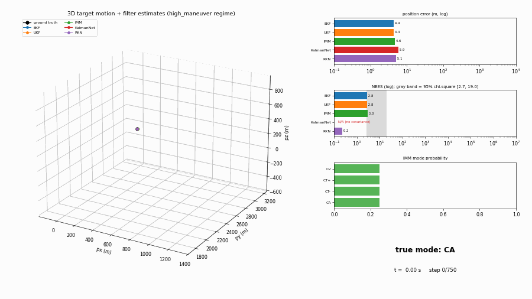

# Learned vs. classical filtering benchmark

A standalone research benchmark (in [`tools/kalmannet_bench/`](https://github.com/PavelGuzenfeld/gst-nvmm-cpp/tree/main/tools/kalmannet_bench))
comparing a **tuned IMM** against **KalmanNet** and **Recursive KalmanNet** for
maneuvering-target tracking with azimuth/elevation/range measurements — the
question being whether a learned Kalman filter is worth the complexity over a
classical one for an edge tracker (Jetson Orin, CPU/DLA/PVA only, GPU reserved
for the vision pipeline).

Short answer: **a well-tuned IMM wins on accuracy, calibration, and cost.** The
learned filters underperform on accuracy here; Recursive KalmanNet's one genuine
win is that it produces a *usable, better-calibrated covariance* where vanilla
KalmanNet produces none. See the full write-up and results tables in
[`REPORT.md`](https://github.com/PavelGuzenfeld/gst-nvmm-cpp/blob/main/tools/kalmannet_bench/REPORT.md).

## Watching the filters behave

The clip below animates one maneuvering trajectory (the `high_maneuver` regime,
15 s at 50 Hz) with every filter estimating the target live, plus a HUD:

What to watch:

- **3D panel** — ground truth (black) with each filter's fading tail. **IMM
  (green) stays glued to the target** while EKF/UKF drift a few hundred metres,
  and KalmanNet (red) / RKN (purple) wander off by hundreds to ~1600 m.
- **Position-error bars** (log) — the headline "who's tracking, who's lost."
- **NEES bars** (log, with the 95% chi-square band shaded) — EKF/UKF are pinned
  far above the band (textbook overconfident); IMM sits closest to it. **Vanilla
  KalmanNet shows N/A — it has no covariance to grade** (state dim 9 > measurement
  dim 3), which is itself a key finding.
- **IMM mode-probability bars** — watch IMM *switch models* (CV → CT → CA) as the
  maneuver changes, tracking the true-mode banner. This adaptivity is why the
  classical filter wins on maneuvers.

## Relation to the shipped elements

This is a research study, not a shipped element — but it directly informs the
Kalman filtering in [`nvmmfusekf`](elements/nvmmfusekf.md) and
[`nvmmsamurai`](elements/nvmmsamurai.md), whose box-tracking Kalman core
([`kalman_box`](elements/nvmmtracker.md)) is a constant-velocity filter in the
same family as the CV baseline here.
